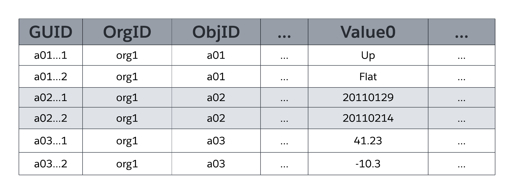
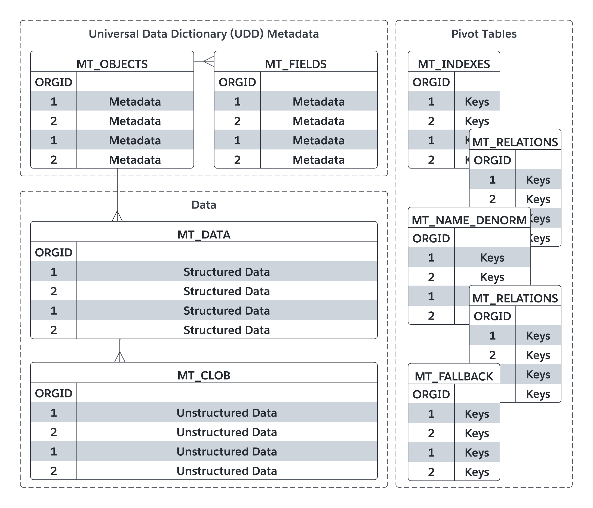

# 数据模型之大宽表 ｜ 宽表就不能有灵活性和性能了吗

过去的数据库实践总是指引我们表不要太大，否则在查数据会引起很多内存消耗，我们也使用ETA的方式来减少这结构的变化问题。
但偏偏 saleforce 就不这么实践，或者是他有底气去做一个大宽表把所有属性都塞进去，而且这个表还是对多个客户的自定义业务对象，下面我们来看看他们是怎么做到的。

我先回答一个问题，宽表多宽才算宽? 
根据官方的资料显示，它的业务实体，可以有 500 个属性。也就是说有 500 个属性这么宽。当然我们并不知道他具体的实现策，不过我可以猜测可能以 100 个作为一个单位分片，由 5 个分片组成。

让我们暂时先抛开这个问题，回到宽表的设计思路上。

## 数据结构的设计

根据官方的文档显示，主要用到以下几个关键表：

a. 对象元数据表 MT_Objects
-   也是 entity 的元数据表，用于存储所有对象（包括标准对象和自定义对象）的定义。

-   每个自定义对象都会在这个表中有一条记录，记录对象的名称、API 名、描述等信息。

b. 字段元数据表 MT_Fields

-   自定义字段的定义存储在另一个元数据表中（例如内部的 fields 或类似结构）。

-   每个字段会记录其所属对象、字段名称、API 名、数据类型（如文本、数字、日期等）、长度限制等。

c. 数据存储表 MT_Data

-   实际的数据并不是存储在为每个自定义对象单独创建的表中，而是存储在一个统一的“宽表”中，通常称为 sObject 数据表。

-   这个表的设计非常灵活，使用了类似键值对（Key-Value Pair）的结构：
    -   ID 列：每条记录有一个唯一的 ID
    -   对象类型列：标识这条记录属于哪个对象（通过对象的前缀或内部标识符）。
    -   通用字段列：包含多个通用列（如 value1, value2, ..., valueN），这些列可以存储不同类型的数据，具体由元数据解释。
    -   大文本/二进制列：对于长文本、富文本或文件附件，使用单独的存储机制（例如 Blob 存储）。

这是官方的资料显示意图：

值 0 ...ValueN 弹性列（也称为槽）存储分别映射到 MT_Objects 和 MT_Fields 中声明的表和字段的应用程序数据。所有 Flex 列都使用可变长度的字符串数据类型，以便它们可以存储任何结构化类型的应用程序数据（字符串、数字、日期等）。如下图所示，同一对象的两个字段不能映射到 MT_Data 中的同一槽进行存储;但是，单个 slot 可以管理多个 field 的信息，只要每个 field 都源于不同的对象即可。

MT_Fields可以使用多种标准结构化数据类型（如文本、数字、日期和日期/时间）中的任何一种，也可以使用特殊用途的丰富结构数据类型，如选择列表（枚举字段）、自动编号（自动递增、系统生成的序列号）、公式（只读派生值）、主从关系（外键）、复选框（布尔值）、电子邮件、URL 等。MT_Fields也可以是必需的（不是 null）并具有自定义验证规则（例如，一个字段必须大于另一个字段），平台会强制执行这两个规则。

当您声明或修改对象时，平台会管理定义该对象的 MT_Objects 中的一行元数据。同样，对于每个字段，平台会管理 MT_Fields 中的一行，包括将字段映射到 MT_Data 中特定 flex 列以存储相应字段数据的元数据。由于该平台将对象和字段定义作为元数据而不是实际数据库结构进行管理，因此系统可以容忍在线多租户应用程序架构维护活动，而不会阻止其他组织和用户的并发活动。相比之下，传统关系数据库系统的在线表重新定义通常需要临时锁，并且通常需要费力、复杂的流程和计划内的应用程序停机时间。

如上图中 MT_Data 的简化表示所示，`弹性列是通用数据类型（可变长度字符串），这使平台能够在使用各种结构化数据类型（字符串、数字、日期等）的多个字段之间共享单个弹性列`。
该平台使用规范格式存储所有 Flex 列数据，并在应用程序从 Flex 列读取数据或将数据写入 Flex 列时根据需要使用`底层数据库系统数据类型转换函数（例如，TO_NUMBER、TO_DATE TO_CHAR）`。

MT_Data 还包含上图中未显示的列。例如，有四列用于管理审核数据，包括哪个用户创建了一行以及该行的创建时间，以及哪个用户上次修改了行以及上次修改该行的时间。MT_Data 还包含一个 IsDeleted 列，平台使用该列指示何时删除了行。

我们大根能看明白了，那么继续，如些，怎么保证性能，打平后数据怎么检索？

## 几种 Indexes
传统的数据库系统依靠本机数据库索引来快速定位数据库表中具有与特定条件匹配的字段的特定行。但是，为 MT_Data 的 flex 列创建本机数据库索引是不切实际的，因为该平台使用单个 flex 列来存储具有不同结构化数据类型的许多字段的数据。相反，该平台通过将标记为索引的字段数据同步复制到MT_Indexes数据透视表中的相应列来管理MT_Data索引。
MT_Indexes包含强类型的索引列，如 StringValue、NumValue 和 DateValue，平台使用这些列来查找相应数据类型的字段数据。例如，平台会将 MT_Data Flex 列中的字符串值复制到 MT_Indexes 中的 StringValue 字段，将日期值复制到 DateValue 字段，依此类推。MT_Indexes 的基础索引是标准的非唯一数据库索引。当内部系统查询包含引用对象中结构化字段的搜索参数时，平台的自定义查询优化器会使用 MT_Indexes 来帮助优化关联的数据访问作。

它们还实现一 MT_Unique_Indexes 用做业务约束，不同的用户对对象的唯一约束可能会有差别。
为了支持自定义字段的唯一性，该平台使用 MT_Unique_Indexes 数据透视表;此表与 MT_Indexes 表非常相似，不同之处在于 MT_Unique_Indexes 的基础本机数据库索引强制实施唯一性。当应用程序尝试将重复值插入到需要唯一性的字段中，或者管理员尝试对包含重复值的现有字段强制实施唯一性时，平台会向应用程序返回相应的错误消息。

整体的实现如下，你看懂了吗？
