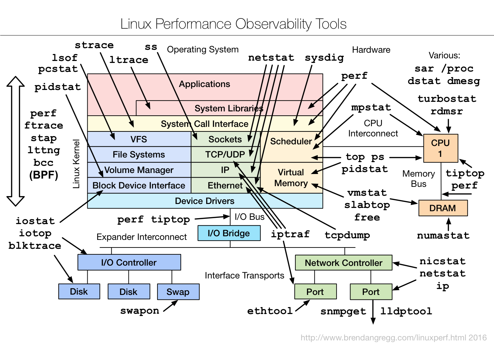
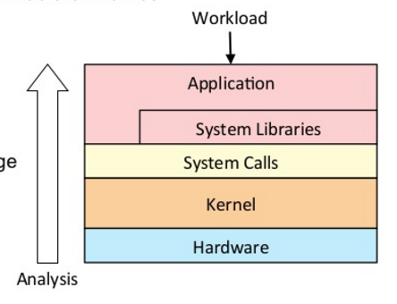

# Linux System Performance 系统性能

## overview

## Linux Perf Analysis in 60s

| cmd | desp |
| ---- | ---- | 
|uptime  |  load averages |
| dmesg \| tail | kernel errors  |
| vmstat 1 | overall by time |
| mpstat -P ALL 1 | CPU balance |
| pidstat 1 |  process usage |
| iostate  -xz 1   |  disk I/O |
| free -m  | memory usage |
| sar -n DEV 1 | network I/O |
| sar -n TCP,ETCP 1 | TCP stats |
| top |  check overview|

**每一种资源：**
Utilization 利用
Saturation 饱和
Errors  错误

**Resource Analysis 资源分析**

从层面系统的性能分析: 从系统工具和粒度（metrics）开始
正面（Pros）: 
   a. 通用性(Generic)
   b. 一堆资源(Aids resource)
   c. 性能调整 (perf tunning)

负面（cons）： 
    a. 不均匀覆盖（Uneven coverage）
    b. 不确定性 False positives

**Workload analysis 从工作负载分析**

从应用粒度的上下文开始

正面（Pros）: 
   a. 精确,均衡的粒度(Accurate，proportional metrics)
   b. 应用上下文(App context)

负面（cons）： 
    a. 应用特殊性（App specific）
    b. 难以让应用中资源定位出来(Difficult to dig from app to resource)

**Benchmarking 基准**
benchmarking is error prone （基准是一种错误的倾向）

**Benchmarking paradox 基准悖论**