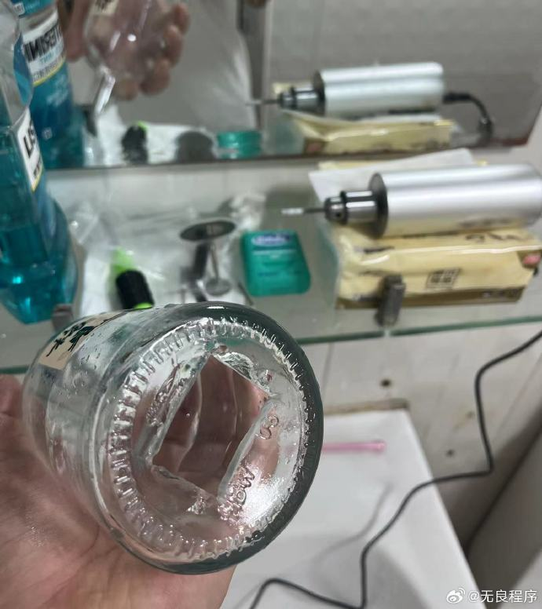
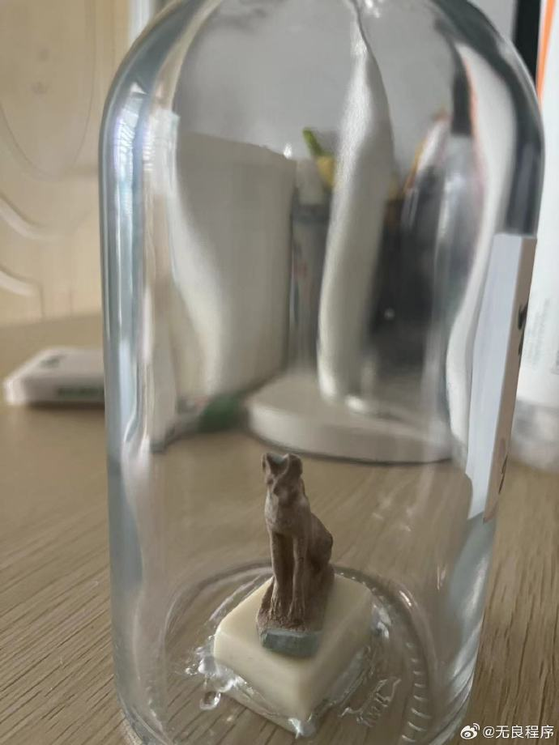
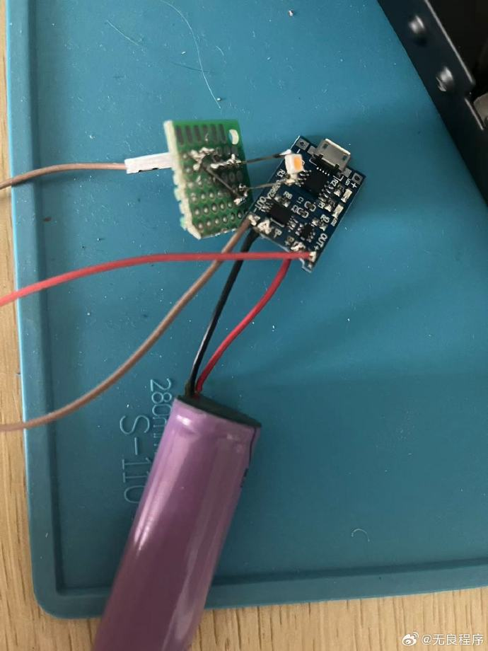
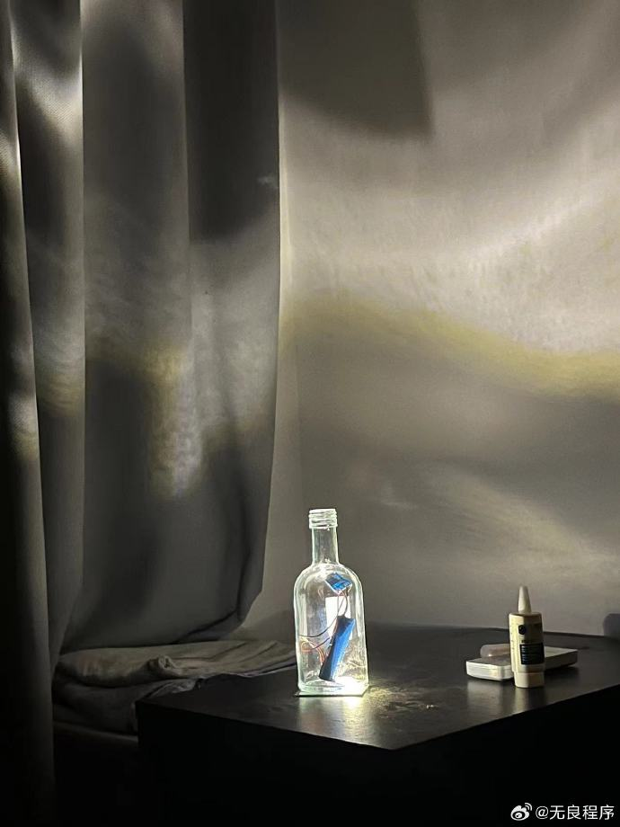
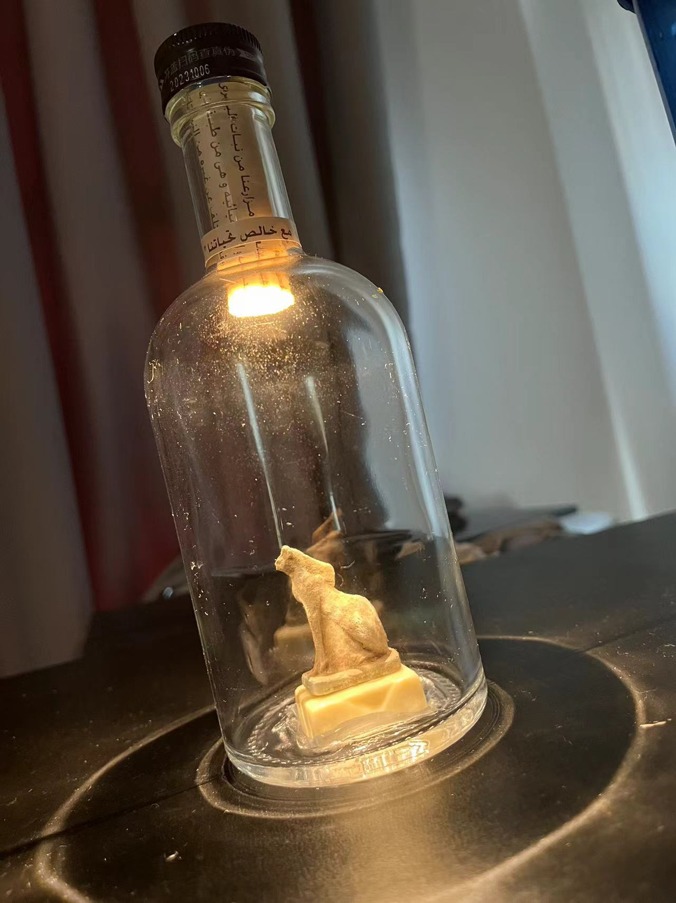
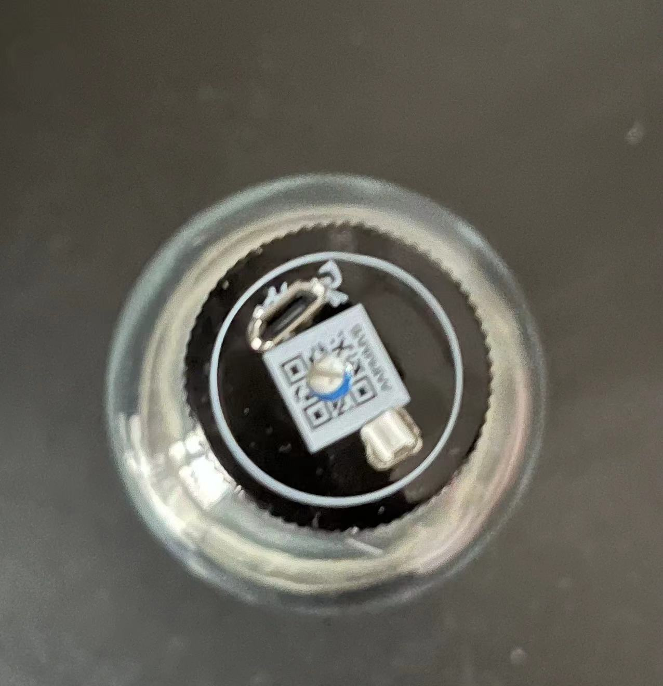

---
draft: false
date: 2024-11-11
categories:
  - diy
tags:
  - diy
slug: make-a-lamp
pin: true
--- 
# 做一盏灯

从小开始时不时脑子就会出现，用身边的东西，做点什么的想法。
用纸箱、包装盒子和透明胶带捯饬我的私人柜子，打开柜门挂着几层小格子，每个格子放不同的文具；用吊扇风页装在拆出来的自行车发电机，负载装上电灯，在楼顶体验风能发电，风力是不太稳定的，风向也是个问题； 把音乐贺卡里的装置拆出来，压缩到一个透明的小徽章盒子里，打算送给暗恋对象，可惜开孔工具不好，比较丑没有送出去 ...
<!-- more -->
可能频率较高的是，想用一个玻璃瓶子，做一盏灯。毕竟时不时得就会出现一个好看的瓶子，装酒的，或者是别的。可我从来没做过，因为缺少给玻璃瓶子开口子的工具。小学就知道需要什么工具，可惜家里只有做五金门窗的大型工具，没有小型的，当然我也没有排除困难去寻找，毕竟只是一个想法。

前些日子就买了一套一直没用，于是前几天，那个瓶子就出现了。
做一盏灯可以分解为三步：
a. 结构设计：主要是这个瓶子，选择什么地方打孔，计划放什么东西进去
b. 电路设计：这部分比较简单，电池导线开关小灯，调光也可以考虑不过对结构有要求
c. 艺术设计：这部分感觉比较难，除了灯珠本身的结构，如色温，光线偏角，还有如何隐藏不好看的电池， 这次在网上看了好几个微观素材，感觉要达到理想的效果得多次试错

总的构想：
瓶子里是一只在埃及地摊买的石猫，由一颗买奶茶送的麻将驮着，它的背后竖着两个18650锂电池伪装成神庙柱子，麻将背后的低功耗黄色 led 从下到上为一切打光。

## Day 1
我完成了 a 和 b， c 感觉没法完成了，也不是不能用 ~

## Day 2
放了几天后，买了一些零件，最后用了14500把电池塞进瓶颈， 瓶盖放了充电口，开关，调光电阻， 理论续航20小时。 用了一块有阿拉伯文的纸盖电池， 也有led 散热等考虑 … 达到diy完成度的人生新成就。

