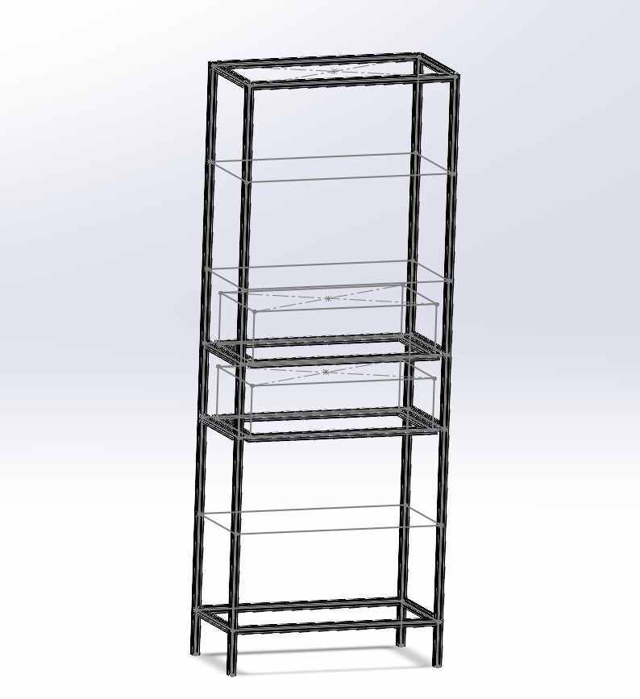
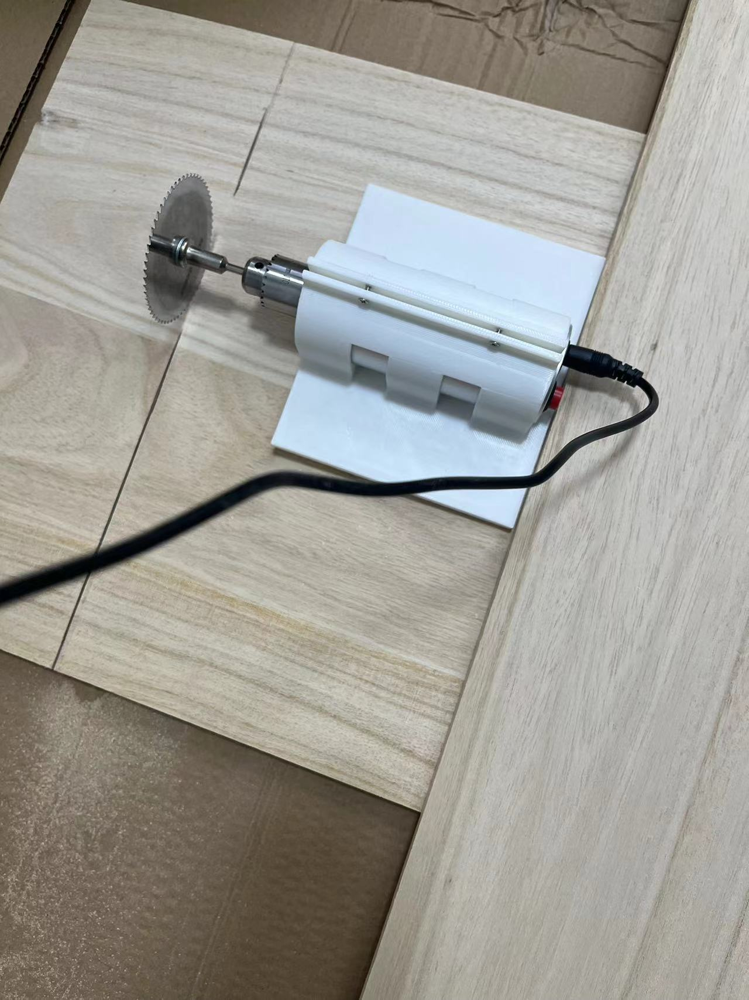
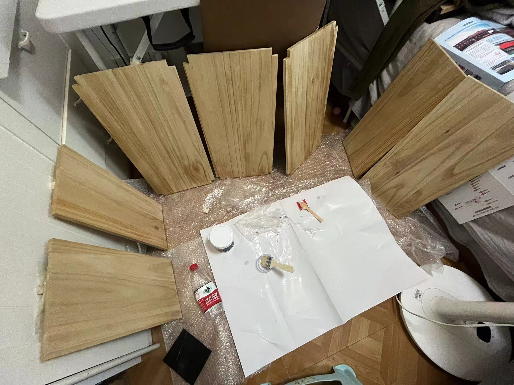
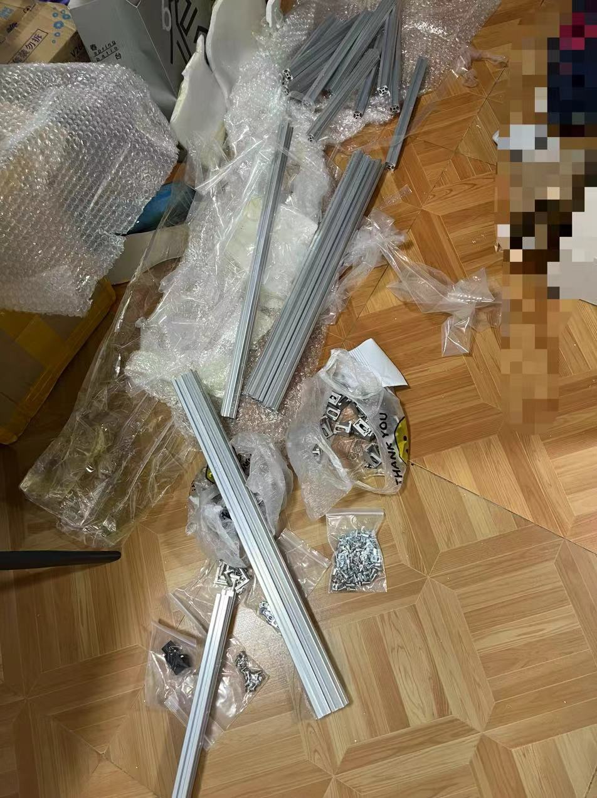
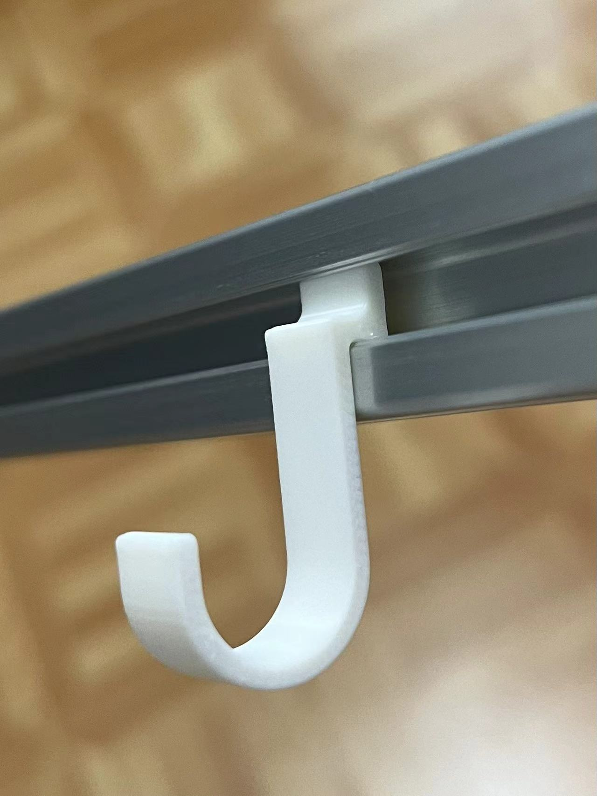
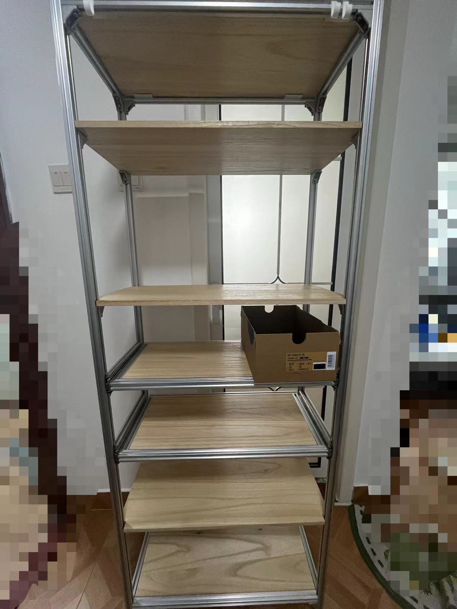
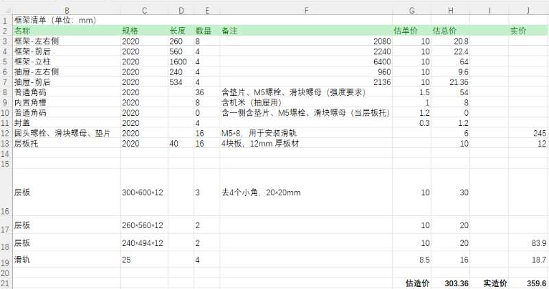

---
date: 2024-12-27
categories:
  - diy
tags:
  - diy
--- 

# 做一个厨房置物架

## solidworks 设计
根据空间的情况，设计规格为 `600 * 300 * 1600mm`
一层宽度可以放下两个锅。

先做了一版预想的效果，后面了解到单位成本和强度，简化如下：
<!-- more -->   

## 材料采购和加工

不管是铝型材和木板的尺寸切割都是要加钱的，也是感觉可以省一些成本，自己有一个小电磨机，我感觉自己可以 diy 一个切割机，把木板的部分搞定。
后面证明有可性有，但不多，完成了切割，但整个切割花了一天的工时。手磨锯的扭力太小的，一条线要切两面，一个面还需要分两个深度，就算是这样，还会经常卡锯片，在地上操作也很不方便。

木板虽然是很便宜的桐木，但为了体验防腐，买了水性漆做防护。

其他的就是装框架和抽屉滑轨的一些工作。

## 挂钩
找了一圈，没有 2020 的挂钩，自己 diy 打印几个。

## 成品与造价
达成了原设想的效果，厨房有这个之后，整洁和宽敞了不少，成品看起来也不 low 。

造价如下，不便宜。

