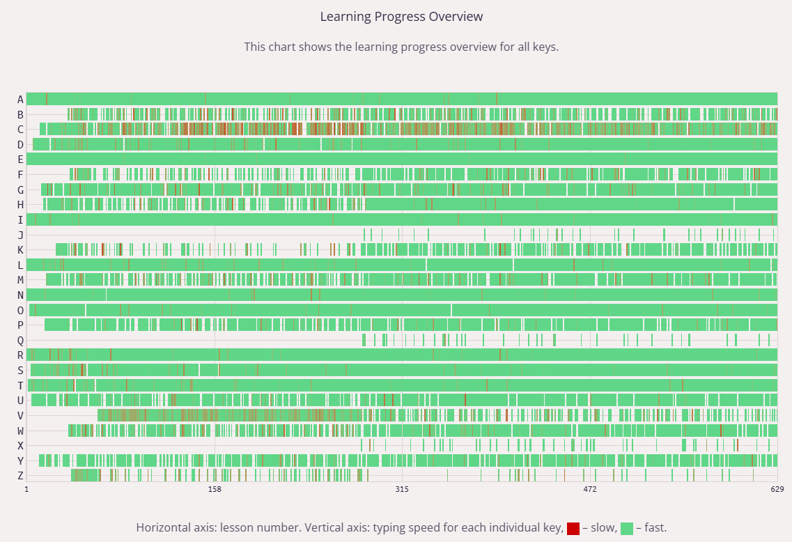
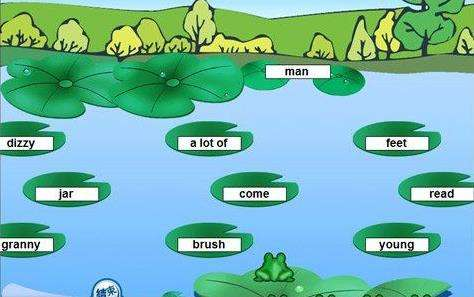

# 打字练习

上一次练习打字的什么时候，久得我想不起来了，至少应该有十五年了吧。

我用的是五笔输入法，身边的同事， 工作这些年只碰到两个， 毫无疑问也是 90 前的。 
在我差不多读初中的时候，二哥在家里整了一台式电脑，那时还是 Windows98 的操作系统。他练习五笔打字，我也跟着背字根，练了起来。
不过的可以上机的时间不多，也在家里的小霸王里练。

其实现在回想起来，当时练的既不认真也不系统，可能一级二级简码是比较熟悉的，还有基本的日常用字，拆分结构清晰的也可以打。
就这样的水平，过去了二十年，可能在大学的时候也练过一些，不过应该也没有系统地去练，或者是我练过了，后面又忘记了也不一定。

这些年的工作，因为角色的一些变化，日常协作的事情变多了，写文档的数量也增长了好几倍，所以当年的一些不足也暴露了出来。
例如， `塞栈善幸矢临` 等这些字总是打的时候会卡住， 由于当下表达思路的需求，就打拼音来完成，或是当时也查它的编码了，但后面再碰到还是重蹈覆辙。

于是这一次，我又学了一遍。

## 常用字
这一次的方法和之前不一样，我先用中文常用的 1500 字打一遍， 碰到打不出来，或者需要尝试几次编码才找到的就让它错着，最后我得到了 100 个识别码的问题 和 60 几十拆字结构的问题的常用字。

识别码部分：
```
父苦资善简索助科买忙血穿某草胡效列艺警升概访硬油危睛亦浪补巨拥宽皇献剑栈途巧闲缘亡赛
映桥叹享寒延辈赞冒眉径辞悲页触阻申插拒卡乌辛灭俗帐糊倾骗乙祥刑剩督召彻甘尺兑亏叔漫贯
浓井匹仰截颇废鼻惑斜羊屋亚
```
我还发现还有一些是我一开始按错键了，所以没找到，不过这也是一个问题。

识别码是五笔里很基础的一个概念，之前记过，日常打中文不多(工作沟通用的字其实不多)又逐渐地忘记。


拆字容易出错的部分：
```
矢才气场题千刻严武广古甚余朝环兵派顾惊巴户属击齐尤州养永托皮临农卫顿乡套辛幸夏卑监骨
卷释判逐午孔墙尊乃塞盛县雅乘刺载赵聚
```
这里有是字根的记忆、组合规则、甚至是写字顺序的问题，不过上面也混合了一些识别码的问题。像 `矢` 拆 人大（TD）还是 二人（RW），`聚` 是 bcti 不是 bce，`养` 是 udyj 不是 udw 等等。


后面，还需要把 top 3000 的中文字也过一遍，一方面是好多字多年没有写，只是打字或者阅读，直接写是很可能忘记的，自然也打不出来，一方面也是加强一下语文，感觉这方面也是偏薄弱些的。

## 打字速度
经过测试，之前因为一些卡字的原因，输入大概是 45~50 wpm（字每分），解决完上面的字后，到了 60 wpm。

感觉还不够，于是我又测试了下字母输入的速度，发现也是存在一些问题的。发现我对左下区的按键 `zxcv` 的输入速度比较慢，当然对应右手还有 `，。、` 这几个，不过因为输入的频率不高所以影响不大。

还发现对 C 键的输入手指是错的，不应该用食指，而是要用中指，于是刻意纠正，又起初先承先降低了，后面又再慢慢熟悉。不过毕竟都用了这么多年了，要完全纠正还是比较困难的，后面观察看情况吧。英文输入大概在 45 wpm (英文的键长大，就是输入6、7 个字母才是一个 word, 五笔只要 3 点几)。



经过几个小时的练习，再回去打中文，在没有卡生字的情况下，可以到 70 wpm，卡的的话可能 65 wpm。

中文测试：[jsxiaoshi.com](https://www.jsxiaoshi.com/)

字母测试和练习：[ww.keybr.com](https://www.keybr.com/profile)

## “雪恨”
多年前，练字时金山打字通里带了几个游戏，最印象深刻是 激流勇进 和 生死时速，就没嬴过，而这一次我轻松雪恨了。




其实打字不只是字母，还有对单词的熟悉程度，而游戏的默认设置中，初中水平的单词当然不在话下。

这里还可以下载：[金山打字通全家桶](https://bbs.pcbeta.com/viewthread-1896454-1-1.html)

## 最后
相对于人的思考、语言组织和输出讲，就算是打字速度是 30 wpm 也是够用的，更高的订字速度只是应对一些密集输出的场景。
这次的练习主要是扫清了一些五笔的卡点，也算是补上一点小债务，顺便小提升了一下打字的速度，反正也是闲着。

## 附录
[常用300字 & 难拆字 集合](world-collection.md)
