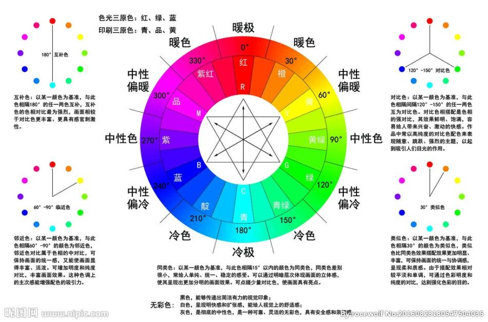
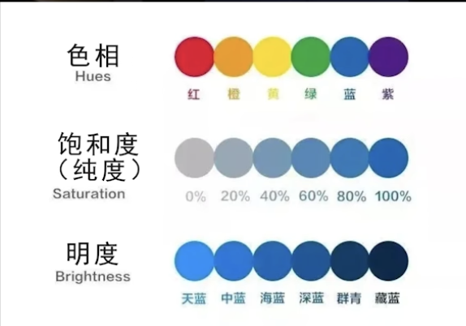
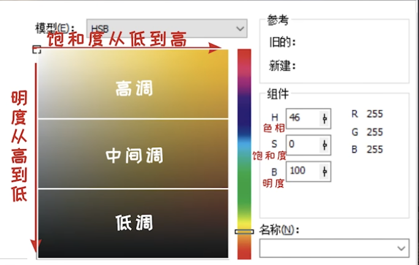
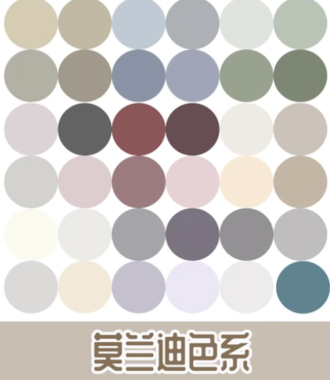
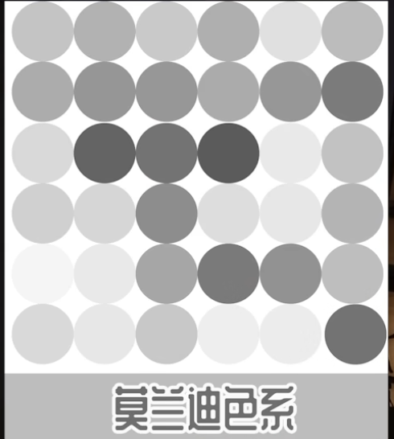
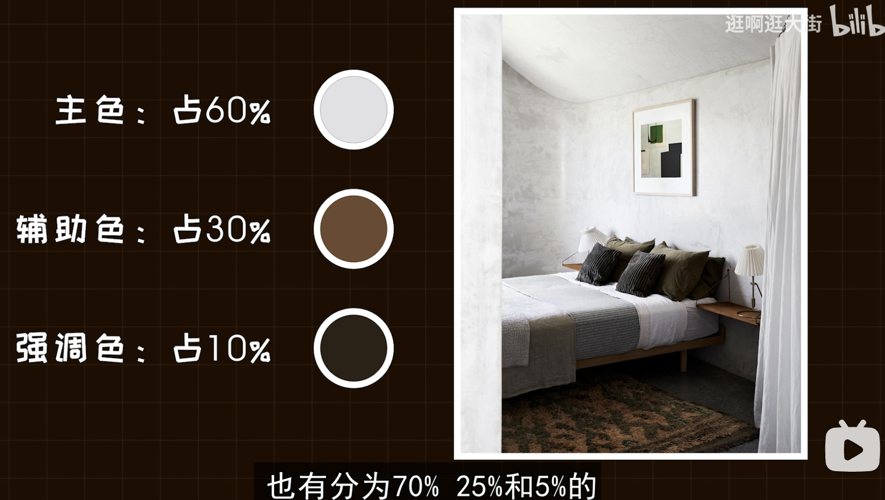
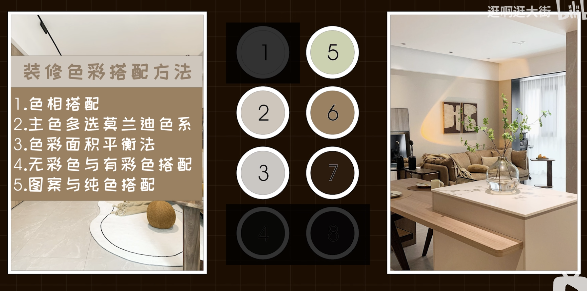

## 色彩基础理论

<!-- more -->

明度高，饱和度低的莫兰迪配色：

饱和度为0时，是灰色：

这时再调整明度，就是黑和白。

## 家装的黄金搭配法则：

装修色彩的搭配方法：
1.色相搭配
2.主色多选莫兰迪色系
3.色彩面积平衡法
4.无彩色与有彩色的搭配
5.图案与纯色的搭配

原视频总结：

[装修色彩搭配速成](https://bilibili.com/video/BV1Fu411q7bL/) 

## 示例总结 

总结家装的原则：
①性冷淡风格：莫兰迪彩色配无彩色方案； 
②同类色风格：颜色差异小耐看； 
③对比色：用631法则，白色及高亮度色作为6，实木及其同类色作为3（或者黑灰作为3），强调色（高饱和来一个） 
④严格遵守总色彩数少于8（比如用方案③墙面就有三种颜色了（白，其他高亮度色，强调色），柜子使用白色+木色（或者花纹或者灰黑），沙发配合强调色或者木色（买回来的肯定单独色系，配不好）加上窗框电视的黑色，灯只能在黑白选，地板木色是装修自带（瓷砖或者木色），7种颜色了，此时你还可以在白棕强调色的三种相近色中选一种配上（如果冰箱洗衣机扫地机器人又多了一种颜色，那就没了）。

其他的还有冷暖搭配，色调的软硬搭配。