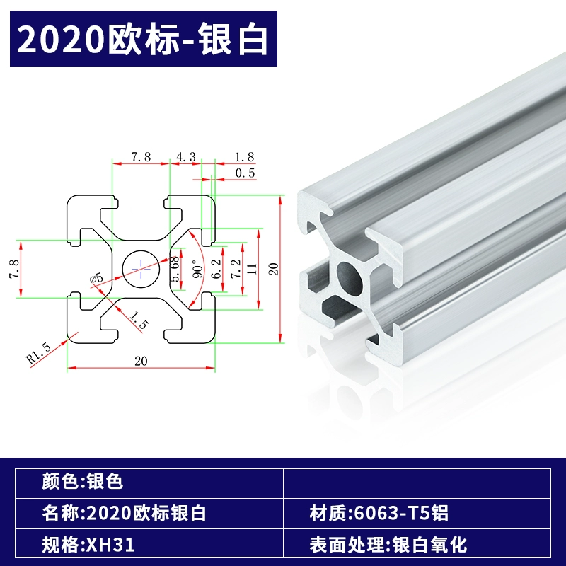
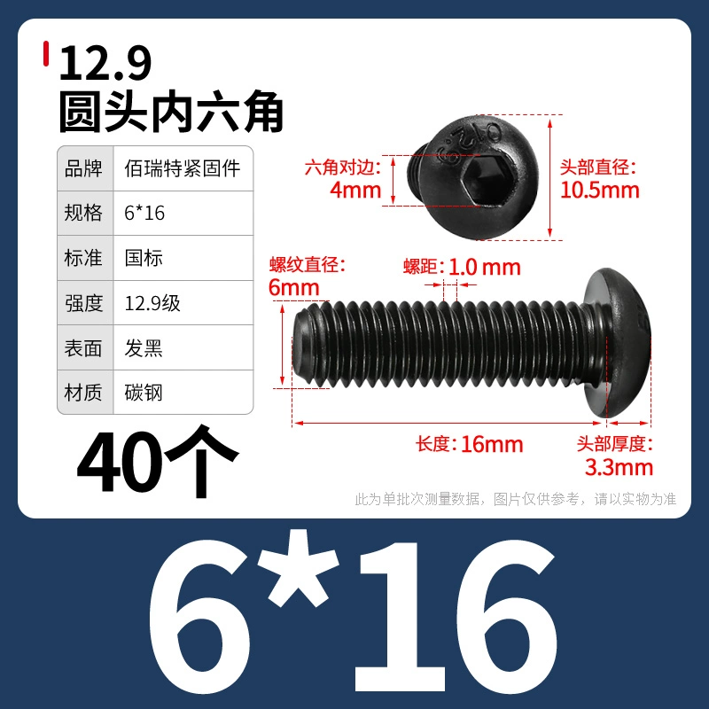
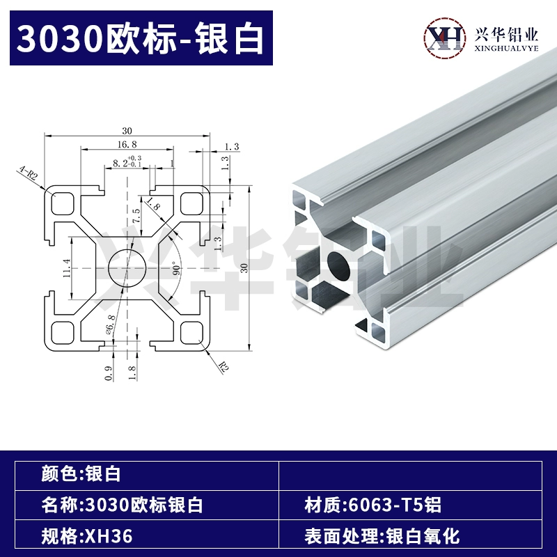
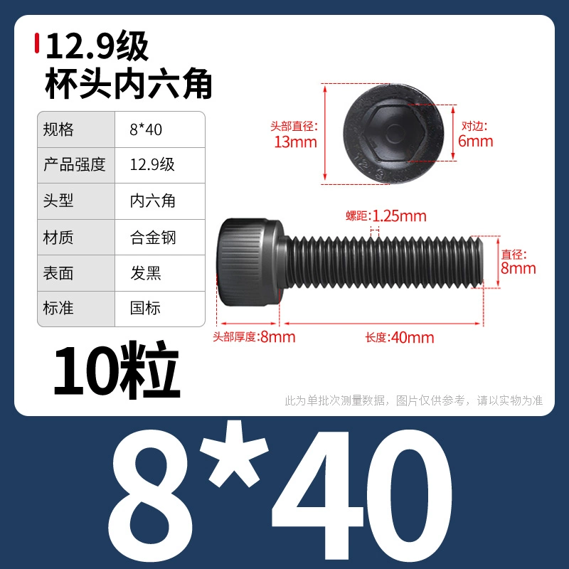
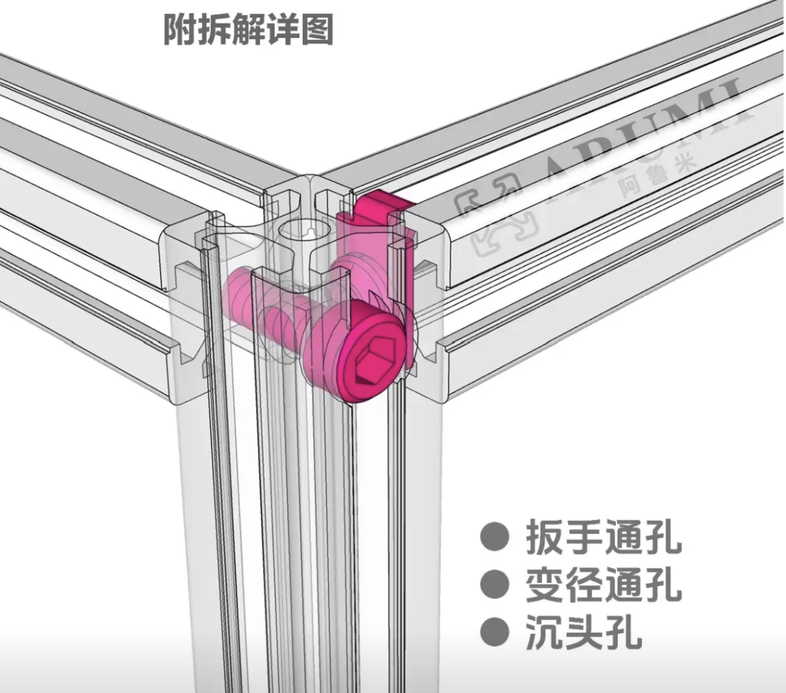
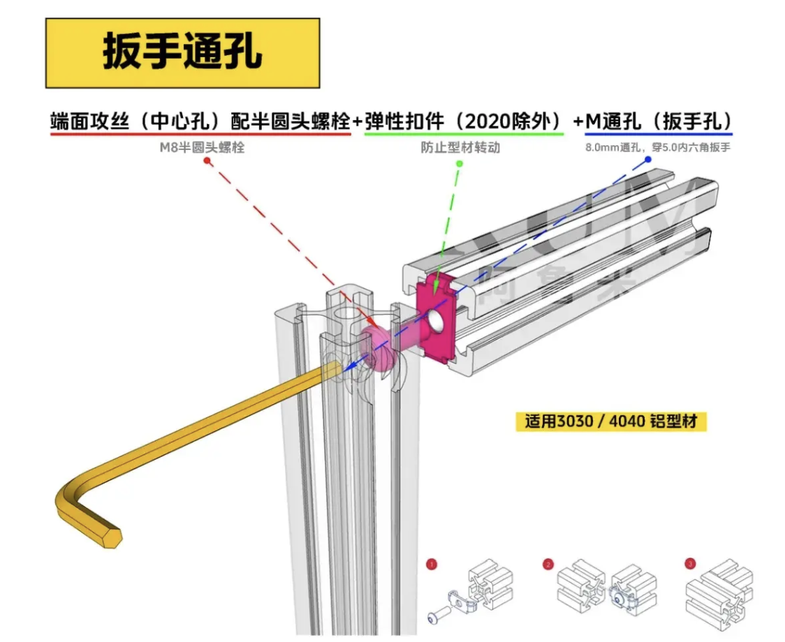
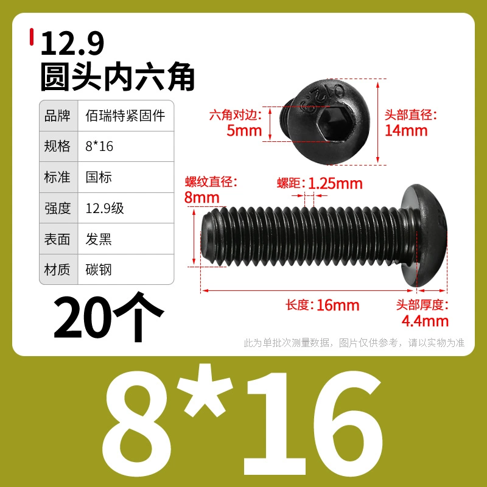
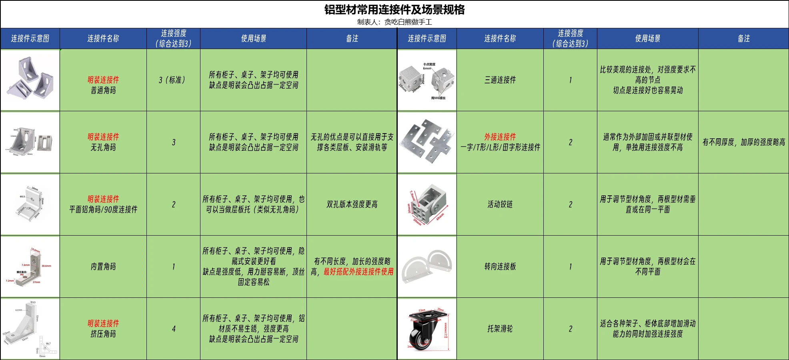
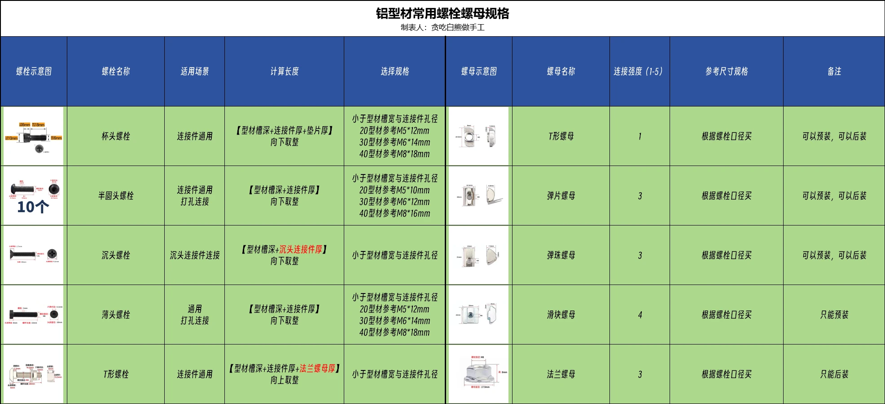

## 基础信息

厚度高一些，孔径会相应变小

## 攻丝
### 2020 铝型材
中间孔径多是 5mm，m6 丝锥攻丝, 使用m6 螺丝

选用的沉头螺丝(考虑攻丝的长度)：
贯穿连接，适合使用  m6 六角头，长度为 14 + 16 =30，规格如下：

### 3030 铝型材：
中央孔径 6.8 ，m8 丝锥攻丝, 使用m8 螺丝
沉头孔 14mm, 同时也是口哨孔径
螺丝孔 6mm

选用的沉头螺丝(考虑攻丝的长度)：
贯穿连接，适合使用  m8 六角头，长度为 19 + 21 =40，规格如下：

4040 的中央孔径也多是 6.8 ,也是用 m8 丝锥和螺丝。

### 板手通孔的连接方式
多用于 90 度连接，示例：

板手通孔，但强度会比较弱一些：

使用圆头的螺栓，直接放进 V 槽里，相关的螺丝规格如下：

## 角码

## 螺丝
